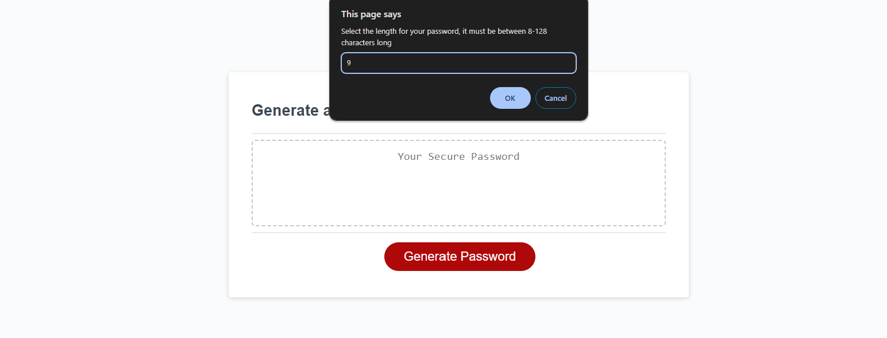
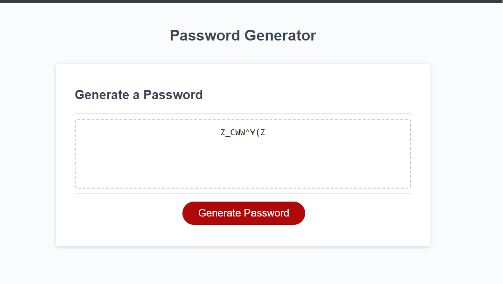

# Password_Generator

See site 

## Overview

This project's requirement was to create an application that an employee can use to generate a random password based on criteria they’ve selected. The prompts that appear at the top of the screen aks the user to select what they would like to include in the password. 

## The options available are:

- User selects the password length between 8 - 128 characters
- User selects if they would like to include in their password lowercase characters
- User selects if they would like to include in their password uppercase characters
- User selects if they would like to include in their password special characters

## Instructions:
- Open the site on your browser
- Click on the generate Password Button
- Prompts appear on the top of the screen
- Select confirm/cancel on each prompt
- Generated code appears in the the white box

